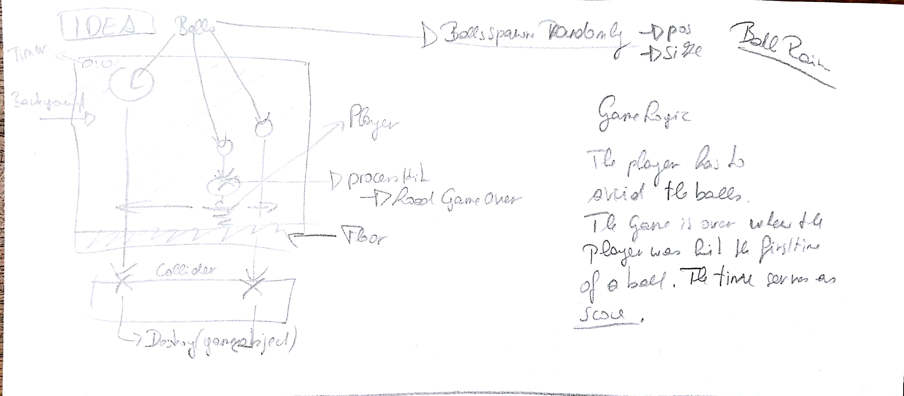
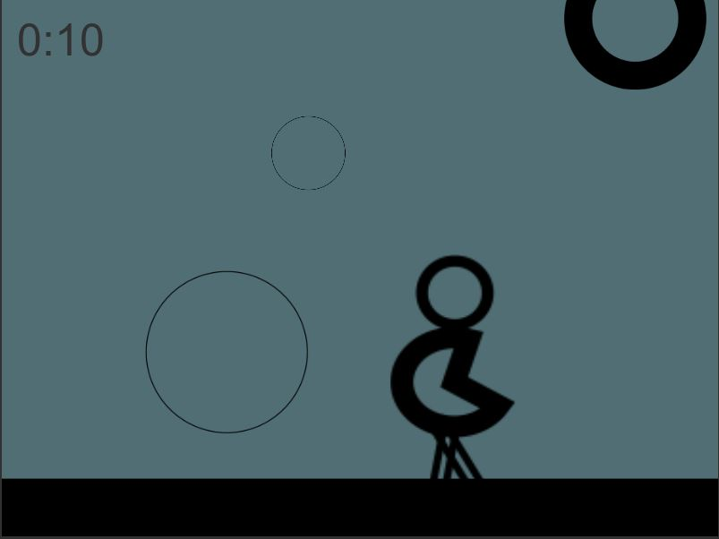

# BallRain 16.12.18

Dev platform: Unity 2018.2.14f, Visual Studio 2017 Community version 15.9.3, Windows 10; 
Target platform: undefined

The player has to sidestep the falling down balls by moving the character along the x axis with A and D or the arrow keys.

The short game consits of tree scenes (welcome, main game, game over);
+ The SceneLoader scriprt is responsible for loading the scenes, the  Timer script provides a Timer function with the output m:s; 
+ The DisplayTimer Script shows the time from the timer in the main game scene as well as in the game over scene; 
+ The BallManager script triggers the collider events for hit player and hit BottomCollider;  
+ The BallSpawner Script spawns the balls randomly along the x axis with a randomly assigned size. 
